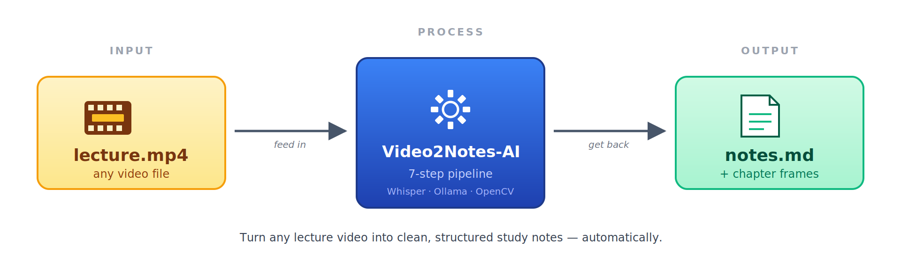
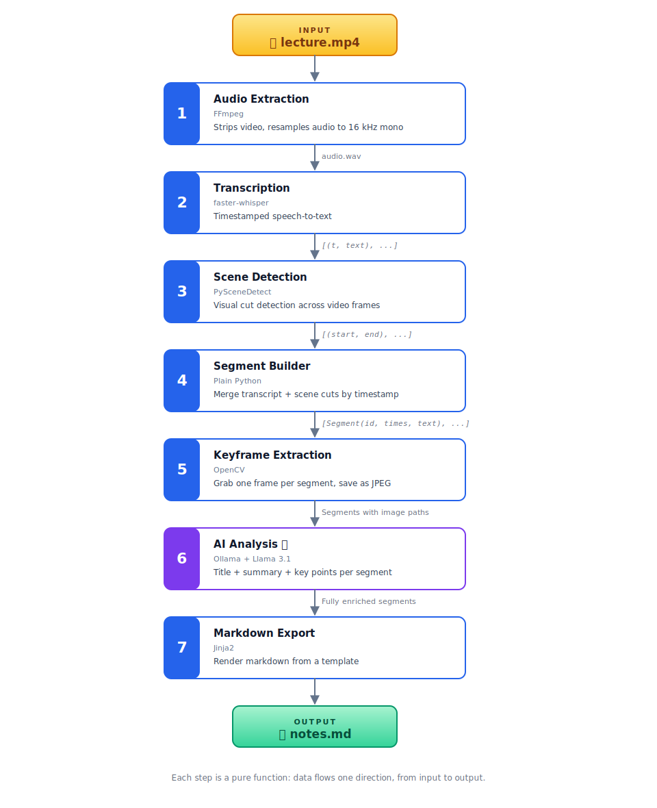
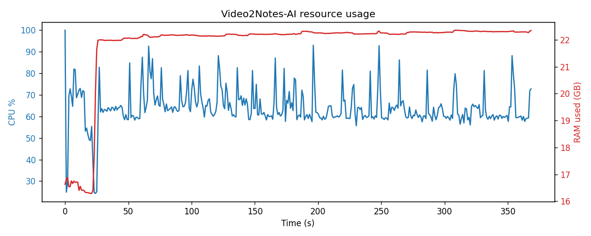

# Video2Notes-AI


**Turn any video into clean, structured notes, automatically.**
___


## The problem

Watching an hour-long lecture to review one specific concept is painful.

- Videos have **no table of contents**
- You can't **search** spoken content
- Taking notes by hand is slow — pause, screenshot, write, rewind, repeat
- A 60-minute video easily costs **2+ hours** to turn into usable notes

The content is valuable. The format is wrong.

---

## How Video2Notes-AI solves it

One command, one video, one output file.




The output is a ready-to-read markdown document with:
- **Chapters** auto-detected from scene changes
- **One screenshot** per chapter from the video
- **AI-written title + summary + key points** for each chapter
- **Timestamps** linking back to exact moments in the video

---

## Architecture

The tool is a **pipeline** — data flows through seven independent steps, each doing one thing well.



### The layers

The code is organized into three layers:

| Layer | Folder | Responsibility |
|---|---|---|
| **Models** | `src/models/` | Data shapes (the `Segment` class). No behavior, just structure. |
| **Modules** | `src/modules/` | The seven pipeline steps. Each one is a pure function: data in → data out. |
| **Utils** | `src/utils/` | Config loading and logging. Boring infrastructure. |

Each module knows about the one before it (via the data it consumes) but nothing more. You could swap Whisper for Google Speech-to-Text tomorrow — only `transcribe.py` would change.

### The data object that ties it all together

Every pipeline step either creates or enriches a `Segment`:

```python
Segment(
  id=1,
  start_time=0.0,
  end_time=58.29,
  transcript="Redis, an in-memory multi-model database...",   # from step 4
  frame_path="output/frames/segment_001.jpg",                 # from step 5
  title="Introduction to Redis",                              # from step 6
  summary="Redis is a fast in-memory database...",            # from step 6
  key_points=["Sub-millisecond latency", ...],                # from step 6
)
```

By the end of the pipeline, each `Segment` is one complete chapter of the output document.

---

## Technology stack

Everything is free and open source.

| Tool | What it does | Why this one |
|---|---|---|
| **Python 3.11** | Glues everything together | Every AI tool has Python bindings |
| **FFmpeg** | Extracts audio from video | Industry standard. Handles every video format. |
| **faster-whisper** | Speech-to-text | OpenAI's Whisper model, 4× faster than the reference |
| **PySceneDetect** | Scene cut detection | Analyzes HSV histograms frame-by-frame |
| **OpenCV** | Grabs video frames | Can seek to any timestamp and read a frame |
| **Ollama + Llama 3.1** | Generates titles & summaries | Local LLM server, no API keys needed |
| **Jinja2** | Renders markdown | Template-based, easy to customize output |
| **Pydantic** | Validates data between steps | Catches typos and bad data early |
| **Rich** | Pretty terminal output | Colored logs, progress bars |

---

## Memory & performance

Here's what the pipeline actually costs to run.


- **Whisper (`base` model)** — ~1.5 GB
- **Ollama with Llama 3.1 8B** — ~6 GB, held for the whole AI phase
- **OpenCV frame buffer** — negligible
- **Everything else** — under 100 MB

**Minimum practical RAM:** 8 GB. Recommended: 16 GB.

This chart shows CPU and RAM usage across the full pipeline run.
It highlights how:
- CPU usage remains steady during preprocessing stages
- Memory spikes when loading the LLM (Ollama)
- The AI analysis step dominates both time and resource consumption



[//]: # (**Measured on a 2.5-minute tech explainer &#40;7 chapters&#41;**:)

[//]: # ()
[//]: # (| Step | Duration |)

[//]: # (|---|---|)

[//]: # (| Audio extraction | 1 s |)

[//]: # (| Transcription | 15 s |)

[//]: # (| Scene detection | 4 s |)

[//]: # (| Segment builder | instant |)

[//]: # (| Keyframe extraction | 1 s |)

[//]: # (| AI analysis | **200 s** &#40;~28s × 7 chapters&#41; |)

[//]: # (| Markdown export | instant |)

[//]: # (| **Total** | **3 min 41 s** |)

[//]: # ()
[//]: # (The AI step dominates — it runs the LLM once per chapter. Longer videos)

[//]: # (with more scene changes produce more chapters, so total time scales with)

[//]: # (chapter count rather than video length. On a GPU, both Whisper and the)

[//]: # (LLM run roughly 10-20× faster.)

# Pipeline execution log


---

## How the tool works

### Installation

**Linux**
```bash
# Clone
git clone https://github.com/you/video2notes-ai.git
cd video2notes-ai

# Load pyenv into this shell
export PYENV_ROOT="$HOME/.pyenv"
export PATH="$PYENV_ROOT/bin:$PATH"
eval "$(pyenv init - bash)"

# Pin this folder to 3.11.13
pyenv local 3.11.13

# Verify BEFORE making the venv
python --version      # MUST say Python 3.11.13

# Only now create the venv
python -m venv env
source env/bin/activate

# Install deps
pip install -r requirements.txt

# Install FFmpeg (system-level)
sudo apt install ffmpeg        # Debian/Ubuntu

# Install Ollama + download the LLM
curl -fsSL https://ollama.com/install.sh | sh
ollama pull llama3.1:8b        # ~4.7 GB, one-time download
```
### Usage

```bash
# Drop your video in
cp /path/to/lecture.mp4 data/sample.mp4

# Run the pipeline
python src/main.py data/sample.mp4

# Read the result
code output/notes.md
```

**Windows**

```bash
# Clone the repo
git clone https://github.com/YOUR-USERNAME/video2notes-ai.git
cd video2notes-ai

# Create a virtual environment with Python 3.11 specifically
py -3.11 -m venv venv

# Activate the venv 
venv\Scripts\activate

# You should see (venv) appear at the start of your prompt

# Install Python dependencies
pip install --upgrade pip setuptools wheel
pip install -r requirements.txt

# Pull the LLM model (~4.7 GB download, takes 10-30 min)
ollama pull llama3.1:8b
```
### Usage

```bash
# Drop a video into data\
copy C:\path\to\your_lecture.mp4 data\sample.mp4

# Run the pipeline
python src\main.py data\sample.mp4

# Open the result
start output\notes.md
```


### What you get

```
output/
├── notes.md              ← your structured notes
└── frames/
    ├── segment_001.jpg   ← one keyframe per chapter
    ├── segment_002.jpg
    └── ...
```

Each `notes.md` chapter looks like this:

```markdown
## Chapter 1 — Introduction to Redis
⏱ 00:00:00 – 00:00:58 · 58.3s


Redis is an in-memory multi-model database created in 2009,
designed for sub-millisecond latency...

**Key points:**
- Stands for Remote Dictionary Server
- In-memory reads, disk persistence
- Used by Twitter and other high-traffic sites
```

---

## Configuration

All knobs live in `config.yaml`. Change model sizes, scene thresholds, output formats without touching code.

```yaml
whisper:
  model_size: "base"        # tiny | base | small | medium | large-v3
  device: "cpu"             # cpu | cuda

scenes:
  threshold: 27.0           # lower = more chapters
  min_scene_length: 30.0    # seconds; merge shorter scenes

ai:
  enabled: true
  model: "llama3.1:8b"
  temperature: 0.3
```

---

## Project structure

```
video2notes-ai/
├── config.yaml              ← all tunables
├── requirements.txt
├── data/                    ← user input videos
├── output/                  ← generated notes + frames
├── .cache/                  ← pipeline working files (auto-cleaned)
└── src/
    ├── models/segment.py    ← the Segment data class
    ├── modules/             ← 7 pipeline steps
    │   ├── audio.py
    │   ├── transcribe.py
    │   ├── scenes.py
    │   ├── segments.py
    │   ├── keyframes.py
    │   ├── ai.py
    │   └── export.py
    ├── templates/
    │   └── notes.md.j2      ← output template
    └── utils/               ← config + logger
```

---

## License

MIT
