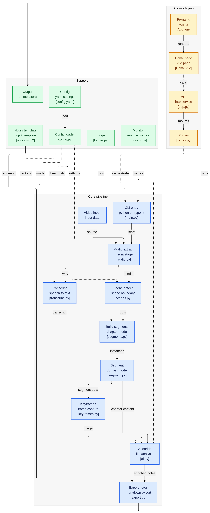

# Video2Notes-AI


**Turn any video into clean, structured notes — from the terminal or your browser.**

---

## The problem

Watching an hour-long lecture to review one specific concept is painful.

- Videos have **no table of contents**
- You can't **search** spoken content
- Taking notes by hand is slow — pause, screenshot, write, rewind, repeat
- A 60-minute video easily costs **2+ hours** to turn into usable notes

The content is valuable. The format is wrong.

---

## How Video2Notes-AI solves it

Upload a video. Get back a structured document with chapters, screenshots, summaries, and key points — automatically.


The output is a ready-to-read markdown document with:

- **Chapters** auto-detected from scene changes
- **One screenshot** per chapter from the video
- **AI-written title + summary + key points** for each chapter
- **Timestamps** showing the exact moments covered by each chapter

---

## Architecture

The tool is built in three layers that work together: a **Vue frontend**, a **Flask REST API**, and a **7-step AI pipeline**.



### Access layers

| Layer | Files | Responsibility |
|---|---|---|
| **Frontend** | `App.vue`, `Home.vue` | Vue 3 UI — upload video, poll for status, display results |
| **API** | `app.py`, `routes.py` | Flask REST service — receives uploads, manages jobs, serves outputs |

### Core pipeline layers

| Layer | Folder | Responsibility |
|---|---|---|
| **Models** | `src/models/` | Data shapes (the `Segment` class). No behavior, just structure. |
| **Modules** | `src/modules/` | The seven pipeline steps. Each one handles one stage of the workflow: input in, enriched output out. |
| **Utils** | `src/utils/` | Config loading, logging, and resource monitoring. |

Each module knows about the one before it (via the data it consumes) but nothing more. You could swap Whisper for Google Speech-to-Text tomorrow — only `transcribe.py` would change.

### The data object that ties it all together

Every pipeline step either creates or enriches a `Segment`:

```python
Segment(
  id=1,
  start_time=0.0,
  end_time=58.29,
  transcript="spoken text recognized from the video...",   # from step 4
  frame_path="output/frames/segment_001.jpg",              # from step 5
  title="LLM-generated chapter title",                     # from step 6
  summary="LLM-generated summary of this segment...",      # from step 6
  key_points=["LLM-generated key point", ...],             # from step 6
)
```

By the end of the pipeline, each `Segment` is one complete chapter of the output document.

---

## REST API

The Flask backend exposes four endpoints. The pipeline is long-running, so processing is handled asynchronously — upload returns a `job_id` immediately, then poll for completion.

| Method | Endpoint | Description |
|---|---|---|
| `GET` | `/api/health` | Check if the server is running |
| `POST` | `/api/process` | Upload a video and start the pipeline |
| `GET` | `/api/status/<job_id>` | Poll for job status (`processing` / `done` / `failed`) |
| `GET` | `/api/notes/<job_id>` | Download the finished `notes.md` |

### Example flow

```bash
# 1. Upload a video
curl -X POST http://localhost:5000/api/process \
  -F "video=@lecture.mp4"
# → {"job_id": "abc-123", "status": "processing"}

# 2. Poll until done
curl http://localhost:5000/api/status/abc-123
# → {"status": "done", "result": {"notes_path": "...", "segment_count": 7}}

# 3. Download notes
curl http://localhost:5000/api/notes/abc-123 -o notes.md
```


---

## Technology stack

Everything is free and open source.

| Tool | What it does | Why this one |
|---|---|---|
| **Python 3.11** | Glues the pipeline together | Every AI tool has Python bindings |
| **Flask** | REST API backend | Lightweight, zero-config, fits a single-service tool |
| **Vue 3** | Browser frontend | Reactive UI, easy to extend |
| **FFmpeg** | Extracts audio from video | Industry standard. Handles every video format. |
| **faster-whisper** | Speech-to-text | OpenAI's Whisper model, 4× faster than the reference |
| **PySceneDetect** | Scene cut detection | Analyzes HSV histograms frame-by-frame |
| **OpenCV** | Grabs video frames | Can seek to any timestamp and read a frame |
| **Ollama + Llama 3.1** | Generates titles & summaries | Local LLM server, no API keys needed |
| **Jinja2** | Renders markdown | Template-based, easy to customize output |
| **Pydantic** | Validates data between steps | Catches typos and bad data early |
| **Rich** | Pretty terminal output | Colored logs, progress bars |

---

## Memory & performance

Here's what the pipeline actually costs to run.

- **Audio extraction (FFmpeg)** — ~0.1 GB
- **Whisper transcription (`base` model)** — ~1.5 GB
- **Scene detection (PySceneDetect)** — ~0.3 GB
- **Segment building (Python only)** — ~0.1 GB
- **Keyframe extraction (OpenCV)** — ~0.4 GB
- **AI analysis (Ollama + Llama 3.1 8B)** — ~6.0 GB, held for the whole AI phase
- **Markdown export (Jinja2)** — ~0.1 GB

**Peak RAM:** ~6 GB during AI analysis.
**Minimum practical RAM:** 8 GB. Recommended: 16 GB.

This chart shows overall system CPU and RAM usage during one sample run of the full pipeline. The AI step is the main resource bottleneck.


# Pipeline execution log


---

## Installation

### Prerequisites

- Python 3.11
- Node.js 18+ (for the Vue frontend)
- FFmpeg
- Ollama

### Backend — Linux

```bash
# Clone
git clone https://github.com/Abdev314/video2notes-ai.git
cd video2notes-ai

# Set up Python 3.11 with pyenv
export PYENV_ROOT="$HOME/.pyenv"
export PATH="$PYENV_ROOT/bin:$PATH"
eval "$(pyenv init - bash)"
pyenv local 3.11.13

# Create and activate venv
python -m venv env
source env/bin/activate

# Install Python dependencies
pip install -r requirements.txt

# Install FFmpeg
sudo apt install ffmpeg        # Debian/Ubuntu

# Install Ollama and pull the LLM
curl -fsSL https://ollama.com/install.sh | sh
ollama pull llama3.1:8b        # ~4.7 GB, one-time download
```

### Backend — Windows

```bash
git clone https://github.com/Abdev314/video2notes-ai.git
cd video2notes-ai

py -3.11 -m venv venv
venv\Scripts\activate

pip install --upgrade pip setuptools wheel
pip install -r requirements.txt

ollama pull llama3.1:8b
```

### Frontend

```bash
cd frontend
npm install
npm run dev      # development server at http://localhost:5173
```

---

## Usage

### Option 1 — Browser UI

```bash
# Terminal 1: start the Flask API
source env/bin/activate
python api/app.py

# Terminal 2: Build vue project
cd frontend
npm run build
```

Open `http://localhost:5173`, upload a video, and wait for the notes to appear.

### Option 2 — CLI (unchanged)

```bash
# Drop your video in
cp /path/to/lecture.mp4 data/sample.mp4

# Run the pipeline directly
python src/main.py data/sample.mp4

# Read the result
code output/notes.md
```

### Option 3 — API only

See the [REST API](#rest-api) section above for direct `curl` examples.

---

## What you get

```
output/
├── notes.md              ← your structured notes
└── frames/
    ├── segment_001.jpg   ← one keyframe per chapter
    ├── segment_002.jpg
    └── ...
```

Each chapter in `notes.md` looks like this:

```markdown
## Chapter 1 — Example Chapter Title
⏱ 00:00:00 – 00:00:58 · 58.3s


This section summarizes the main idea covered in the chapter
using a short, readable paragraph...

**Key points:**
- Important concept or takeaway
- Supporting detail from the video
- Actionable point, example, or definition
```

---

## Configuration

All knobs live in `config.yaml`. Change model sizes, scene thresholds, and output formats without touching code.

```yaml
whisper:
  model_size: "base"        # tiny | base | small | medium | large-v3
  device: "cpu"             # cpu | cuda

scenes:
  threshold: 27.0           # lower = more chapters
  min_scene_length: 30.0    # seconds; merge shorter scenes

ai:
  enabled: true
  model: "llama3.1:8b"
  temperature: 0.3
```

---

## Project structure

```
Video2Notes-AI/
├── src/
│   ├── main.py              ← pipeline entry point (CLI + callable by API)
│   ├── modules/             ← the 7 pipeline steps
│   │   ├── audio.py
│   │   ├── transcribe.py
│   │   ├── scenes.py
│   │   ├── segments.py
│   │   ├── keyframes.py
│   │   ├── ai.py
│   │   └── export.py
│   ├── models/              ← Segment data model
│   └── utils/               ← config, logger, monitor
├── api/
│   ├── app.py               ← Flask app factory
│   └── routes.py            ← API endpoints
├── frontend/
│   └── src/
│       ├── App.vue
│       └── Home.vue
├── data/                    ← drop input videos here
├── output/                  ← generated notes and frames
├── docs/                    ← diagrams and screenshots
├── config.yaml
└── requirements.txt
```